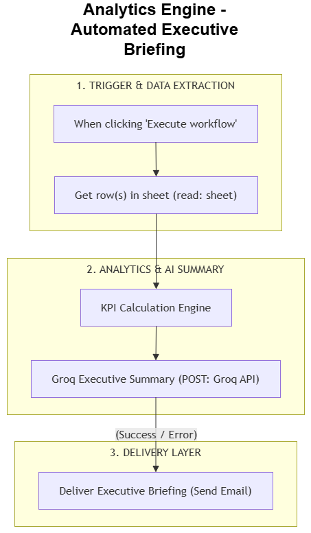

# Automated Executive Briefing & Analytics Engine

An end-to-end automated ETL and AI reporting pipeline built in n8n. It extracts raw data from Google Sheets, computes deterministic KPIs using JavaScript, generates narrative executive summaries using Groq (LLM), and dispatches formatted HTML reports directly via email.

---

## 📐 Architecture

---

## 🛠️ Tech Stack & Key Features

* **Orchestration:** n8n (Visual Automation Engine)
* **Data Ingestion:** Google Sheets API
* **Transformation Engine:** Custom JavaScript Node (Deterministic Math & Statistical Analytics)
* **AI Synthesis Layer:** Groq API (LLM Narrative Generation)
* **Delivery System:** SMTP / Email Node (Formatted HTML)

---

## 💡 Key Architectural Design Choices

* **Separation of Deterministic Code vs. Generative AI:** Statistical calculations, percentage growths, and totals are computed strictly inside JavaScript before hitting the LLM. This guarantees 100% mathematical accuracy while retaining natural language reporting.
* **Privacy & Security:** Sensitive user details, API credentials, and email addresses are sanitized using environment variables and payload transformation.

---

## 🚀 How to Import & Run

1. Clone this repository:
   bash
   git clone https://github.com/Marksman247/executive-briefing-engine.git
2. Import \workflows/workflow.json\ into your n8n instance.
3. Configure your **Google Sheets** and **Groq API** credentials inside n8n.
4. Execute the workflow manually or attach a **Cron Schedule** trigger.
